# A FastAPI Demo with Testcontainers

[](https://github.com/ocrosby/testcontainer-fastapi-demo/actions/workflows/ci.yaml)

An example project using testcontainers along with FastAPI.

If you are new to Testcontainers, it is a Python library that allows you to easily run Docker containers for 
testing purposes. This allows you to run your tests in an isolated environment without having to install and manage 
dependencies on your local machine. Testcontainers supports a variety of containers, including databases, message
brokers, and web servers. I really like the idea because it allows you to run your tests in a consistent environment
without having to worry about using docker-compose or other tools to manage your test environment.  Just run them 
and forget them.  It's my thought that in the local development environment this technique will help me to become 
more productive and efficient.

```mermaid
graph TD
    subgraph Local Development Environment
        subgraph Docker
            direction TB
            A[Docker Compose]
            A --> B[PostgreSQL Container]
            A --> C[FastAPI Container]
        end
        subgraph PyCharm
            direction TB
            D[IDE]
            D --> E[Run/Debug Configuration]
            D --> F[Database Tool Window]
        end
    end

    subgraph Project Structure
        G[app]
        H[tests]
        I[scripts]
        J[sql]
        K[Dockerfile]
        L[docker-compose.yml]
        M[requirements.txt]
        N[setup.cfg]
        O[setup.py]
        P[README.md]
    end

    subgraph app
        G1[__init__.py]
        G2[main.py]
        G3[api]
        G4[core]
        G5[models]
        G6[schemas]
        G7[crud]
    end

    subgraph api
        G3_1[__init__.py]
        G3_2[endpoints]
    end

    subgraph endpoints
        G3_2_1[__init__.py]
        G3_2_2[example.py]
    end

    subgraph core
        G4_1[__init__.py]
        G4_2[config.py]
    end

    subgraph models
        G5_1[__init__.py]
        G5_2[example.py]
    end

    subgraph schemas
        G6_1[__init__.py]
        G6_2[example.py]
    end

    subgraph crud
        G7_1[__init__.py]
        G7_2[example.py]
    end

    subgraph tests
        H1[__init__.py]
        H2[conftest.py]
        H3[test_example.py]
        H4[bdd]
        H5[integration]
    end

    subgraph bdd
        H4_1[__init__.py]
        H4_2[features]
        H4_3[steps]
    end

    subgraph features
        H4_2_1[example.feature]
    end

    subgraph steps
        H4_3_1[test_example_steps.py]
    end

    subgraph integration
        H5_1[__init__.py]
        H5_2[test_example_integration.py]
    end

    subgraph scripts
        I1[create_schema.py]
    end

    subgraph sql
        J1[001_create_posts_table.sql]
        J2[002_create_users_table.sql]
        J3[003_create_comments_table.sql]
        J4[data]
    end

    subgraph data
        J4_1[001_insert_posts.sql]
        J4_2[002_insert_users.sql]
        J4_3[003_insert_comments.sql]
    end
```




## Overview

This project demonstrates how to use [Testcontainers](https://testcontainers.readthedocs.io/en/latest/) to run a 
PostgreSQL container for integration testing with a FastAPI application.

The project also includes examples of using [Pytest](https://docs.pytest.org/en/stable/) for unit and integration testing,
as well as [Pytest-BDD](https://pytest-bdd.readthedocs.io/en/latest/) for behavior-driven development (BDD) testing.

## Requirements

- Python 3.12+
- Docker
- Docker Compose

## Project Structure

```text
testcontainer-fastapi-demo/
├── app/
│   ├── __init__.py
│   ├── main.py
│   ├── api/
│   │   ├── __init__.py
│   │   ├── endpoints/
│   │   │   ├── __init__.py
│   │   │   └── example.py
│   ├── core/
│   │   ├── __init__.py
│   │   └── config.py
│   ├── models/
│   │   ├── __init__.py
│   │   └── example.py
│   ├── schemas/
│   │   ├── __init__.py
│   │   └── example.py
│   ├── crud/
│   │   ├── __init__.py
│   │   └── example.py
├── tests/
│   ├── __init__.py
│   ├── conftest.py
│   ├── test_example.py
│   ├── bdd/
│   │   ├── __init__.py
│   │   ├── features/
│   │   │   └── example.feature
│   │   ├── steps/
│   │   │   └── test_example_steps.py
│   ├── integration/
│   │   ├── __init__.py
│   │   └── test_example_integration.py
├── Dockerfile
├── docker-compose.yml
├── requirements.txt
├── setup.cfg
├── setup.py
├── README.md
```

## Installation

1. Clone the repository:
    ```sh
    git clone https://github.com/ocrosby/testcontainer-fastapi-demo.git
    cd testcontainer-fastapi-demo
    ```

2. Create and activate a virtual environment:
    ```sh
    python -m venv venv
    source venv/bin/activate  # On Windows use `venv\Scripts\activate`
    ```

3. Install the dependencies:
    ```sh
    pip install -r requirements.txt
    ```

## Running the Application

1. Start the FastAPI application:
    ```sh
    uvicorn app.main:app --reload
    ```

2. Open your browser and navigate to `http://127.0.0.1:8000/docs` to see the interactive API documentation.

## Running Tests

1. To run the tests, use the following command:
    ```sh
    pytest
    ```

## License

This project is licensed under the MIT License. See the `LICENSE` file for more details.

## References

- [FastAPI](https://fastapi.tiangolo.com/)
- [Testcontainers](https://testcontainers.readthedocs.io/en/latest/)
- [Pytest](https://docs.pytest.org/en/stable/)
- [Pytest-BDD](https://pytest-bdd.readthedocs.io/en/latest/)
- [Docker](https://www.docker.com/)
- [Docker Compose](https://docs.docker.com/compose/)
- [Docker Python](https://docker-py.readthedocs.io/en/stable/)
- [Docker SDK for Python](https://docker-py.readthedocs.io/en/stable/)
