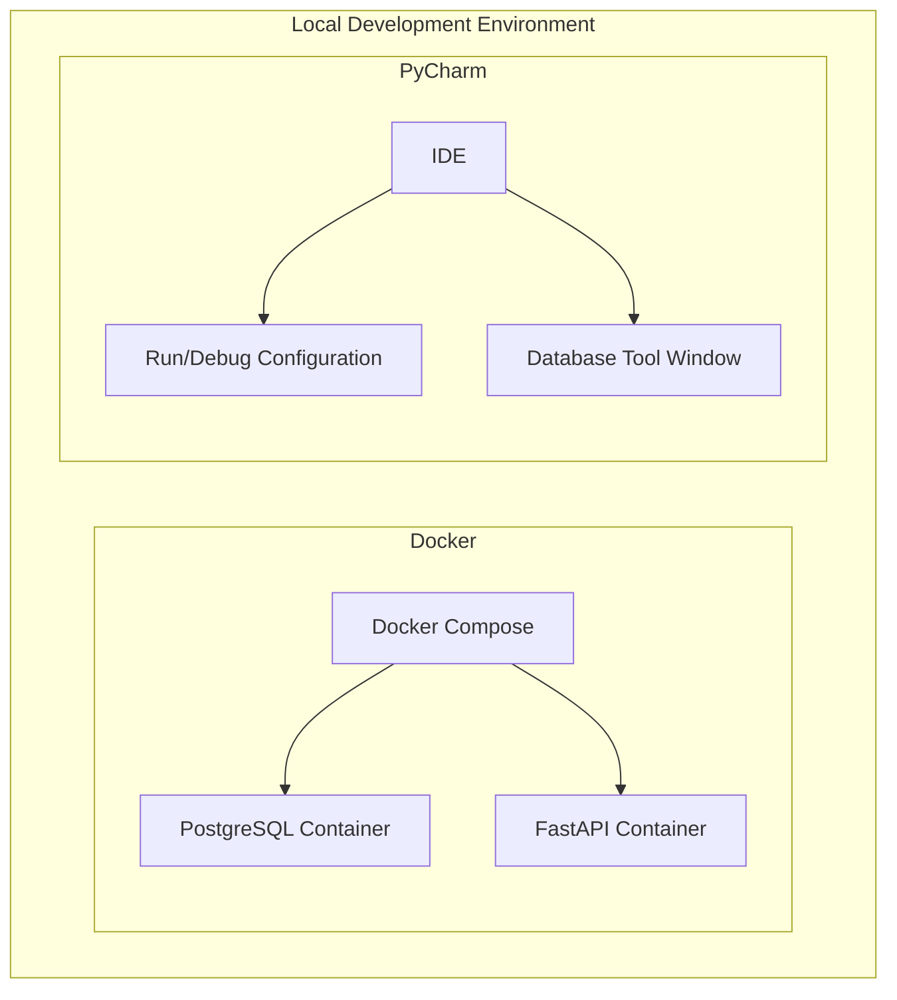

# A FastAPI Demo with Testcontainers

[](https://github.com/ocrosby/testcontainer-fastapi-demo/actions/workflows/ci.yaml)

An example project using testcontainers along with FastAPI.

If you are new to Testcontainers, it is a Python library that allows you to easily run Docker containers for 
testing purposes. This allows you to run your tests in an isolated environment without having to install and manage 
dependencies on your local machine. Testcontainers supports a variety of containers, including databases, message
brokers, and web servers. I really like the idea because it allows you to run your tests in a consistent environment
without having to worry about using docker-compose or other tools to manage your test environment.  Just run them 
and forget them.  It's my thought that in the local development environment this technique will help me to become 
more productive and efficient.




## Overview

This project demonstrates how to use [Testcontainers](https://testcontainers.readthedocs.io/en/latest/) to run a 
PostgreSQL container for integration testing with a FastAPI application.

The project also includes examples of using [Pytest](https://docs.pytest.org/en/stable/) for unit and integration testing,
as well as [Pytest-BDD](https://pytest-bdd.readthedocs.io/en/latest/) for behavior-driven development (BDD) testing.

## Requirements

- Python 3.12+
- Docker
- Docker Compose


Installing fastapi and all dependencies

```shell
pip install fastapi[all]
```

## Project Structure

```text
testcontainer-fastapi-demo/
├── app/
│   ├── __init__.py
│   ├── main.py
│   ├── api/
│   │   ├── __init__.py
│   │   ├── endpoints/
│   │   │   ├── __init__.py
│   │   │   └── example.py
│   ├── core/
│   │   ├── __init__.py
│   │   └── config.py
│   ├── models/
│   │   ├── __init__.py
│   │   └── example.py
│   ├── schemas/
│   │   ├── __init__.py
│   │   └── example.py
│   ├── crud/
│   │   ├── __init__.py
│   │   └── example.py
├── tests/
│   ├── __init__.py
│   ├── conftest.py
│   ├── test_example.py
│   ├── bdd/
│   │   ├── __init__.py
│   │   ├── features/
│   │   │   └── example.feature
│   │   ├── steps/
│   │   │   └── test_example_steps.py
│   ├── integration/
│   │   ├── __init__.py
│   │   └── test_example_integration.py
├── Dockerfile
├── docker-compose.yml
├── requirements.txt
├── setup.cfg
├── setup.py
├── README.md
```

## Installation

1. Clone the repository:
    ```sh
    git clone https://github.com/ocrosby/testcontainer-fastapi-demo.git
    cd testcontainer-fastapi-demo
    ```

2. Create and activate a virtual environment:
    ```sh
    python -m venv venv
    source venv/bin/activate  # On Windows use `venv\Scripts\activate`
    ```

3. Install the dependencies:
    ```sh
    # Install the project dependencies 
    pip install .
   
    # Install the development dependencies
    pip install '.[dev]'
   
    # or
    pip install ".[dev]" 
    ```
    
    These commands will read the depndencies specified in the pyproject.tom file and install them accordingly.  
 

4. Install docker-compose

    ```shell
    brew install docker-compose
    ```

The docker-compose file is used to start the PostgreSQL container for integration testing.


## Running the Application

1. Start the FastAPI application:
    ```sh
    uvicorn app.main:app --reload
    ```

When you install FastAPI (e.g. with `pip install fastapi`), it includes a package
called `fastapi-cli`, this package provides the fastapi command in the terminal.

To run your FastAPI app for development, you can use the `fastapi dev` command.

```shell
fastapi dev app.main:app
```


2. Open your browser and navigate to `http://127.0.0.1:8000/docs` to see the interactive API documentation.


## Routes

### API Routes Documentation

#### Health Check Endpoints
- **Readiness Probe**
  - **Endpoint:** `/health/readiness`
  - **Method:** GET
  - **Description:** Checks if the application is ready to serve requests.

- **Liveness Probe**
  - **Endpoint:** `/health/liveness`
  - **Method:** GET
  - **Description:** Checks if the application is alive.

- **Startup Probe**
  - **Endpoint:** `/health/startup`
  - **Method:** GET
  - **Description:** Checks if the application has started up correctly.

#### Post Endpoints
- **Create Post**
  - **Endpoint:** `/posts`
  - **Method:** POST
  - **Description:** Creates a new post.
  - **Request Body:**
    ```json
    {
      "title": "string",
      "content": "string"
    }
    ```
  - **Response:**
    ```json
    {
      "id": "integer",
      "title": "string",
      "content": "string"
    }
    ```

- **Get All Posts**
  - **Endpoint:** `/posts`
  - **Method:** GET
  - **Description:** Retrieves all posts.
  - **Response:**
    ```json
    [
      {
        "id": "integer",
        "title": "string",
        "content": "string"
      }
    ]
    ```

- **Get Post by ID**
  - **Endpoint:** `/posts/{id}`
  - **Method:** GET
  - **Description:** Retrieves a post by its ID.
  - **Response:**
    ```json
    {
      "id": "integer",
      "title": "string",
      "content": "string"
    }
    ```

- **Update Post**
  - **Endpoint:** `/posts/{id}`
  - **Method:** PUT
  - **Description:** Updates a post by its ID.
  - **Request Body:**
    ```json
    {
      "title": "string",
      "content": "string"
    }
    ```
  - **Response:**
    ```json
    {
      "id": "integer",
      "title": "string",
      "content": "string"
    }
    ```

- **Delete Post**
  - **Endpoint:** `/posts/{id}`
  - **Method:** DELETE
  - **Description:** Deletes a post by its ID.
  - **Response:**
    ```json
    {
      "message": "Post deleted successfully"
    }
    ```

## Running Tests

1. To run the tests, use the following command:
    ```sh
    pytest
    ```

## Docker

Build the docker image

```shell
docker build -t testcontainer-fastapi-demo:latest .
```

Run the docker container

```shell
docker run -d -p 8000:8000 testcontainer-fastapi-demo:latest
```

Stop the docker container

```shell
docker stop $(docker ps -a -q --filter ancestor=testcontainer-fastapi-demo:latest)
```

Remove the docker container

```shell
docker rm $(docker ps -a -q --filter ancestor=testcontainer-fastapi-demo:latest)
```

Remove the docker image

```shell
docker rmi testcontainer-fastapi-demo:latest
```

Prune dangling images (free up disk space)

```shell
docker image prune -f
```

## SQLModel

I have recently decided to use SQLModel instead of SQLAlchemy.  SQLModel is a library that allows you to define your
database models using Python type hints.  It is similar to Pydantic, which is used to define data schemas.  SQLModel
is built on top of SQLAlchemy and Pydantic, so it provides a nice way to define your database models and interact with
your database.  I like the idea of using SQLModel because it allows you to define your database models using Python
type hints, which makes it easier to work with your database models in your code.  It also provides a nice way to


## License

This project is licensed under the MIT License. See the `LICENSE` file for more details.

## References

- [Rest API Tutorial](https://restfulapi.net/)
- [FastAPI](https://fastapi.tiangolo.com/)
- [Testcontainers](https://testcontainers.readthedocs.io/en/latest/)
- [Pytest](https://docs.pytest.org/en/stable/)
- [Pytest-BDD](https://pytest-bdd.readthedocs.io/en/latest/)
- [Docker](https://www.docker.com/)
- [Docker Compose](https://docs.docker.com/compose/)
- [Docker Python](https://docker-py.readthedocs.io/en/stable/)
- [Docker SDK for Python](https://docker-py.readthedocs.io/en/stable/)
- [structlog](https://www.structlog.org/en/stable/)
- [Testing FastAPI with TestContainers](https://samanta-reinosoa.medium.com/testing-fastapi-with-testcontainers-in-gitlab-b7c62068aeef)
- [Pydantic Docs](https://docs.pydantic.dev/latest/)
- [Conventional Commits](https://www.conventionalcommits.org/en/v1.0.0/)
- [Conventional Commits - Quick Summary](https://www.conventionalcommits.org/en/v1.0.0/#summary)
- [Full Stack FastAPI Template](https://fastapi.tiangolo.com/project-generation/)
- [Testing FastAPI](https://github.com/ArjanCodes/examples/blob/main/2023/apitesting/main.py)
- [Diagnosing Problems](https://arjian.codes/diagnosis)
- [Mastering API Testing with FastAPI: Databases, Dependencies, and More!](https://www.youtube.com/watch?v=9gC3Ot0LoUQ)
- [How to Use FastAPI][https://www.youtube.com/watch?v=SORiTsvnU28]
- [Design Guide](https://arjan.codes/designguide)
- [Python Semantic Release Documentation](https://python-semantic-release.readthedocs.io/en/latest/)
- [Angular Style Commits](https://github.com/angular/angular.js/blob/master/DEVELOPERS.md#commits)
